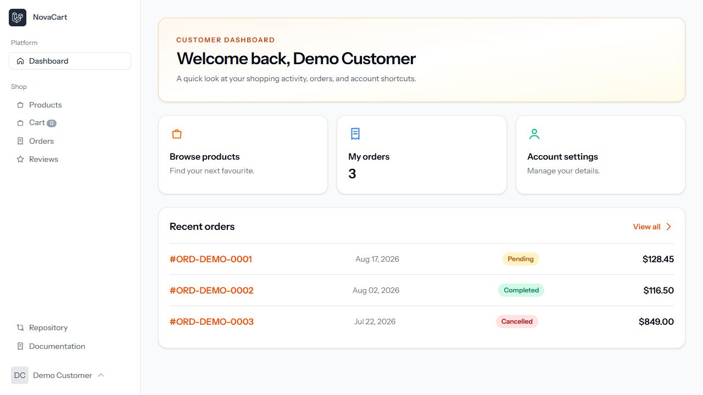
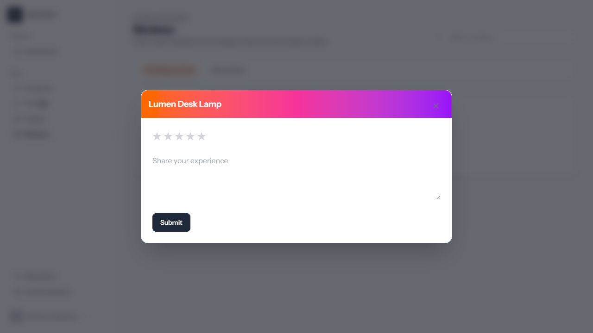
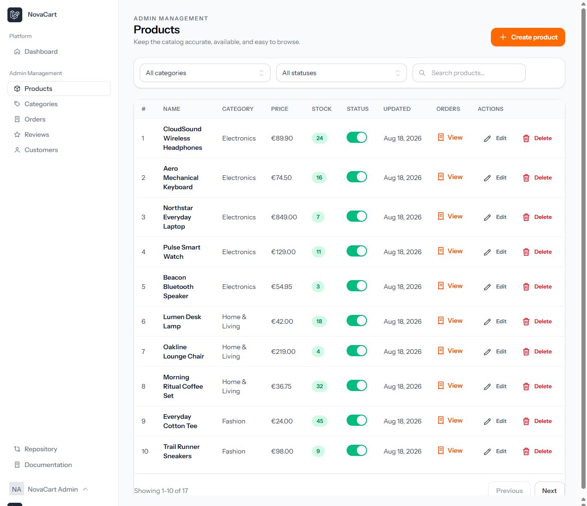
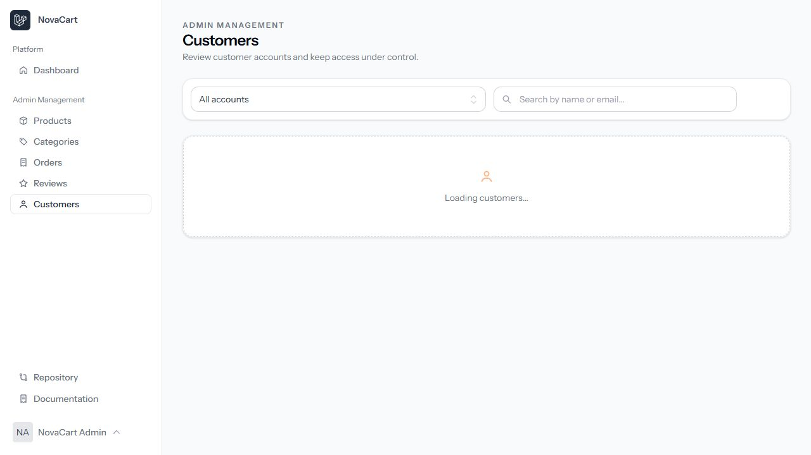

# NovaCart modernization report

## Scope

NovaCart was reviewed as a first Laravel practice project, with the priority order of working behavior first, then a consistent visual system, then a smaller and easier-to-understand frontend stack.

## Main decisions

- Blade remains the page and component system.
- HTMX owns server-rendered table, filter, pagination, and tab updates.
- Ky is used for small JSON mutations such as status changes and form actions.
- jQuery, DataTables, SweetAlert2, Yajra DataTables, Passport, and external icon packages are not part of the active application flow.
- Tailwind, Vite, Chart.js, and Sanctum remain because they fit the project without adding unnecessary runtime weight.
- Icons are rendered by a single local SVG Blade component. This avoids runtime package lookups and the previous generic-circle fallback.
- Alpine is not required by the primary store screens; the few stateful behaviors are handled by HTMX or small vanilla modules.

## Bugs fixed

### Customer

- Customer Orders now loads its HTMX table and filters correctly.
- Customer Reviews now loads both Pending reviews and My reviews without a missing Vite manifest entry.
- Review creation opens an integrated modal instead of navigating to an unstyled page.
- Completed and delivered order states are both accepted when determining review eligibility.

### Admin

- Products and Orders data endpoints are registered before their dynamic `{product}` and `{order}` routes, preventing accidental 404s.
- The shared HTMX pagination component no longer passes Laravel's pagination translation array to `aria-label`, fixing the `htmlspecialchars(Array)` error.
- Reviews use a consistent table, working enable/disable controls, local detail modal, and clear status badges.
- Customer Management was added with search, status filters, edit, suspend, and restore actions.

### Shared UI and performance

- Replaced the old generic-circle icon fallback with explicit local SVG paths.
- Added shared page, toolbar, table, badge, button, state, and modal styles so customer and admin surfaces use the same design language.
- Fixed theme controls for Light, Dark, and System preferences, including persisted selection and system-theme changes.
- Replaced prank/placeholder Repository links with the actual NovaCart repository and Laravel documentation.
- Removed verified-unreferenced legacy jQuery/DataTables pages, scripts, review-to-do flow, scratch files, IDE metadata, and generated cache files.

## Data for manual review

`DemoDataSeeder` creates:

- 1 admin and 3 customer accounts
- 5 categories and 17 products
- 8 orders with pending, processing, shipped, completed, and cancelled states
- 8 product reviews, including data visible in both customer and admin screens

All seeded accounts use the local-only password `password`.

## Verification

The final local verification pass completed with:

- `php artisan test --compact`: 32 passed, 99 assertions
- `npm run build`: passed; 60 modules transformed
- Manual browser checks for customer dashboard, orders, reviews, review modal, admin products, admin orders, admin reviews, review moderation, customer management, account menu, and Light/Dark theme switching
- Composer lock regenerated against the current `composer.json`; the old CI lock mismatch is resolved

## Screenshots

## Cleanup boundary

Obsolete application views and scripts were removed. Historical migration files that are not used by the current ecommerce code were left in place when removing them would break migration continuity for an existing installation; they can be archived separately if this project is declared fresh-only and the database history is intentionally reset.
